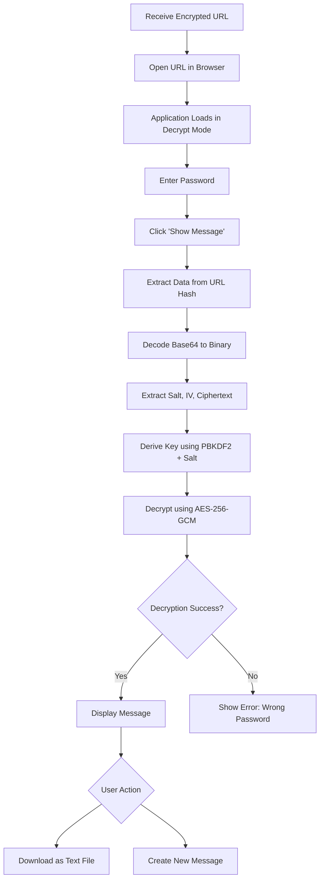

# xsukax URL Secure Messenger

A privacy-focused, client-side encrypted messaging application that enables secure message exchange via AES-256 encryption embedded directly in URL hashes. No server required, no data collected—just pure end-to-end encryption in your browser.

[](https://www.gnu.org/licenses/gpl-3.0)
[](https://xsukax.github.io/xsukax-URL-Secure-Messenger/)

## 🔒 Project Overview

**xsukax URL Secure Messenger** is a lightweight, single-file HTML application that provides true end-to-end encryption for secure message sharing. Unlike traditional messaging platforms that rely on servers and complex infrastructure, this application performs all cryptographic operations entirely within your browser using the Web Crypto API.

The application encrypts your messages using industry-standard AES-256-GCM encryption and embeds the ciphertext directly into a shareable URL. Recipients can decrypt the message by opening the URL and entering the shared password—no accounts, no servers, no data collection.

### Core Capabilities

- **Client-Side Encryption**: All encryption and decryption operations occur locally in your browser
- **URL-Based Message Sharing**: Encrypted messages are encoded in URL hashes for easy distribution
- **Zero Server Dependency**: No backend infrastructure required; works entirely offline after initial page load
- **Password-Based Key Derivation**: Uses PBKDF2 with 100,000 iterations for strong key generation
- **Cross-Platform Compatibility**: Works on any modern browser supporting the Web Crypto API

## 🛡️ Security and Privacy Benefits

### Cryptographic Security

**AES-256-GCM Encryption**  
The application implements AES-256 in Galois/Counter Mode (GCM), providing both confidentiality and authenticity. GCM mode includes built-in authentication, protecting against tampering and ensuring message integrity.

**PBKDF2 Key Derivation**  
Password-based encryption uses PBKDF2 (Password-Based Key Derivation Function 2) with:
- 100,000 iterations (exceeds OWASP recommendations)
- SHA-256 hashing algorithm
- Random 128-bit salt per message
- 256-bit key output

**Cryptographic Randomness**  
All random values (salts, initialization vectors) are generated using `crypto.getRandomValues()`, which provides cryptographically secure pseudorandom numbers from the operating system's entropy source.

### Privacy Guarantees

**Zero Server Communication**  
Once the HTML file loads, no network requests are made. All encryption, decryption, and data handling occurs exclusively in your browser. This architecture eliminates:
- Server-side data storage risks
- Man-in-the-middle attack vectors on transmission
- Third-party access to your messages
- Metadata collection and tracking

**URL Hash Privacy**  
Encrypted data is stored in the URL hash (fragment identifier), which browsers never send to servers. When you share a URL like `https://example.com/app.html#encrypted_data`, everything after the `#` remains local to the browser.

**No Local Storage**  
The application does not use localStorage, sessionStorage, or cookies. Messages exist only:
1. In memory during active encryption/decryption
2. In the URL hash you explicitly share
3. Optionally, in downloaded text files you choose to save

This ensures no residual data remains on your device after closing the browser tab.

### Security Best Practices

- **Password Strength Enforcement**: Minimum 6-character password requirement (recommend 12+ characters)
- **Separate Channel Sharing**: Application encourages sharing URLs and passwords through different secure channels
- **No Password Storage**: Passwords are never stored; they exist only during active encryption/decryption operations
- **Memory Management**: Sensitive data is overwritten when possible to minimize exposure

## ✨ Features and Advantages

### Key Features

- ✅ **AES-256-GCM Encryption** - Military-grade encryption standard
- ✅ **PBKDF2 Key Derivation** - Resistant to brute-force attacks
- ✅ **Client-Side Processing** - Complete privacy, no server dependency
- ✅ **URL Hash Embedding** - Easy sharing via standard URLs
- ✅ **One-Click Copy** - Quick clipboard integration for generated links
- ✅ **Test Link** - Open encrypted messages in new tabs for verification
- ✅ **Message Download** - Export decrypted messages as text files
- ✅ **Responsive Design** - Works seamlessly on desktop and mobile devices
- ✅ **Toast Notifications** - Non-intrusive feedback without alert popups
- ✅ **Single File Application** - No build process, dependencies, or installation required

### Competitive Advantages

**True Zero-Knowledge Architecture**  
Unlike services that claim end-to-end encryption but still handle your data server-side, this application never transmits your messages to any server. You maintain complete control.

**Extreme Simplicity**  
Single HTML file means:
- No complex installation procedures
- No npm dependencies to manage
- No build tools required
- Easy to audit (review the entire codebase in minutes)
- Can be hosted anywhere or run locally

**Provable Security**  
All cryptographic operations use the browser's native Web Crypto API, which undergoes rigorous security audits and is maintained by browser vendors following established standards.

**Offline Capability**  
After initial load, the application works completely offline. Download the HTML file once and use it anywhere, even without internet connectivity.

**No Vendor Lock-In**  
Open source under GPL v3.0 license. Fork it, modify it, host it yourself. You're never dependent on a third-party service staying online.

## 📦 Installation Instructions

### Method 1: Use the Live Version

Access the application directly without installation:

```
https://xsukax.github.io/xsukax-URL-Secure-Messenger/
```

### Method 2: Download and Run Locally

1. **Download the HTML file**

   Visit the GitHub repository and download `index.html`:
   ```bash
   wget https://raw.githubusercontent.com/xsukax/xsukax-URL-Secure-Messenger/main/index.html
   ```

   Or use `curl`:
   ```bash
   curl -O https://raw.githubusercontent.com/xsukax/xsukax-URL-Secure-Messenger/main/index.html
   ```

2. **Open in your browser**

   Simply double-click the downloaded `index.html` file, or:
   ```bash
   open index.html        # macOS
   xdg-open index.html    # Linux
   start index.html       # Windows
   ```

### Method 3: Host on Your Own Server

1. **Clone the repository**
   ```bash
   git clone https://github.com/xsukax/xsukax-URL-Secure-Messenger.git
   cd xsukax-URL-Secure-Messenger
   ```

2. **Serve with any web server**

   Using Python:
   ```bash
   python -m http.server 8000
   ```

   Using Node.js:
   ```bash
   npx http-server -p 8000
   ```

   Using PHP:
   ```bash
   php -S localhost:8000
   ```

3. **Access the application**
   ```
   http://localhost:8000
   ```

### System Requirements

- **Browser**: Any modern browser supporting Web Crypto API
  - Chrome 37+
  - Firefox 34+
  - Safari 11+
  - Edge 79+
  - Opera 24+
- **Internet**: Required only for initial page load (to fetch Tailwind CSS CDN)
- **Storage**: < 1 MB

## 📖 Usage Guide

### Encrypting a Message


**Step-by-Step Process**:

1. **Enter Your Message**
   - Type or paste your secret message in the textarea
   - Supports multiline text and special characters

2. **Create a Strong Password**
   - Enter a password (minimum 6 characters, recommend 12+)
   - Use a mix of uppercase, lowercase, numbers, and symbols
   - This password will be required for decryption

3. **Generate the Secure Link**
   - Click "Generate Secure Link"
   - The application encrypts your message locally
   - A unique URL is generated containing the encrypted data

4. **Share the URL and Password**
   - Copy the generated URL using the "Copy" button
   - Share the URL via one channel (email, messaging app)
   - Share the password via a different secure channel (phone call, separate message)
   - **Important**: Never send the URL and password together

5. **Test the Link (Optional)**
   - Click "Test Link" to open the encrypted message in a new tab
   - Verify decryption works before sharing

### Decrypting a Message



**Step-by-Step Process**:

1. **Open the Encrypted URL**
   - Click the link or paste it into your browser
   - The application automatically detects encrypted data in the URL hash

2. **Enter the Password**
   - Input the password that was used to encrypt the message
   - Password must match exactly (case-sensitive)

3. **Show the Message**
   - Click "Show Message" to decrypt
   - If the password is correct, the original message appears
   - If incorrect, an error notification displays

4. **Save or Share the Decrypted Message**
   - Read the message directly in the browser
   - Click "Download as Text File" to save locally
   - Downloaded files are named `decrypted-message-[timestamp].txt`

### Architecture Overview


### Security Workflow


### Best Practices

**Password Management**
- Use a password manager to generate strong passwords
- Never reuse passwords across different messages
- Avoid dictionary words or personal information

**Sharing Strategy**
- Share URLs via digital channels (email, messaging apps)
- Share passwords via separate channels (phone call, in-person)
- Consider using temporary communication methods for passwords

**Message Handling**
- Delete sensitive messages after reading
- Don't forward encrypted URLs to unintended recipients
- Use the download feature to archive important messages securely offline

## 🔧 Technical Specifications

### Cryptographic Parameters

| Component | Specification |
|-----------|--------------|
| Encryption Algorithm | AES-256-GCM |
| Key Size | 256 bits |
| Key Derivation Function | PBKDF2 |
| KDF Hash Function | SHA-256 |
| KDF Iterations | 100,000 |
| Salt Length | 128 bits (16 bytes) |
| IV/Nonce Length | 96 bits (12 bytes) |
| Authentication Tag | 128 bits (built into GCM) |

### Data Format

Encrypted URL format:
```
https://domain.com/index.html#{base64url_encoded_data}
```

Binary format of encrypted data:
```
[Salt: 16 bytes][IV: 12 bytes][Ciphertext: variable length][Auth Tag: 16 bytes]
```

### Browser Compatibility

The application requires the Web Crypto API. Check compatibility:

| Feature | Chrome | Firefox | Safari | Edge | Opera |
|---------|--------|---------|--------|------|-------|
| crypto.subtle | 37+ | 34+ | 11+ | 79+ | 24+ |
| AES-GCM | 41+ | 34+ | 11+ | 79+ | 28+ |
| PBKDF2 | 41+ | 34+ | 11+ | 79+ | 28+ |

## 🤝 Contributing

Contributions are welcome! Here's how you can help:

1. **Fork the repository**
2. **Create a feature branch** (`git checkout -b feature/amazing-feature`)
3. **Commit your changes** (`git commit -m 'Add amazing feature'`)
4. **Push to the branch** (`git push origin feature/amazing-feature`)
5. **Open a Pull Request**

### Development Guidelines

- Maintain single-file architecture
- Use only native Web Crypto API (no external crypto libraries)
- Follow existing code style
- Add comments for complex cryptographic operations
- Test across multiple browsers

## 📄 License

This project is licensed under the GNU General Public License v3.0.

## 🔐 Security Disclosure

If you discover a security vulnerability, please email the details to the repository maintainer. Do not open public issues for security concerns.

## 🙏 Acknowledgments

- Web Crypto API documentation from MDN Web Docs
- Tailwind CSS for styling framework
- The open-source community for cryptographic best practices

---

**⚠️ Disclaimer**: While this application implements strong cryptography, no encryption is unbreakable. Use strong passwords, keep software updated, and follow security best practices. The authors assume no liability for data loss or security breaches.
